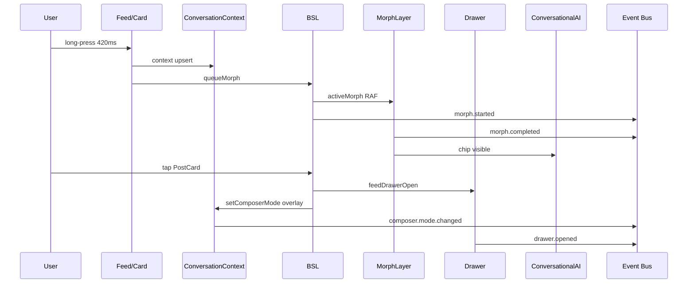

# Ownership Transfer Mapping — Social Landing

**Data:** 2026-05-23  
**Modo:** TEMPORAL OBSERVATION

> Mapeia **quem inicia**, **quem assume**, **quem observa**, **quem deriva**, **quem compete** — em transferências temporais percebidas.

---

## Modelo de papéis

| Papel | Descrição |
|-------|-----------|
| **Initiator** | Dispara sequência (user action ou effect) |
| **Authority** | Pode mutar estado canônico daquele domínio |
| **Observer** | Espelha via bus/shadow — zero write |
| **Derived holder** | Computa de authority — não escreve source |
| **Competitor** | Pode escrever mesmo domínio — priority implicit |

---

## Transferência 1: feed → morph

```
Initiator:     user.pointerdown (420ms)
Authority:     ContextSelectable timer → BSL queueMorph → MorphLayer RAF
Observer:      morph.started/completed, shadow morphActive
Derived:       hiddenContextIds (BSL), chip rail opacity (composer)
Competitor:    none during morph-only path
```

| Fase | Authority | Evidência |
|------|-----------|-----------|
| t+0–420 | Card/ContextSelectable | timerRef |
| t+420 | Module rememberMorphSource | cross-render singleton |
| t+421–423 | ConversationSelectionContext | context upsert |
| t+424–905 | BSL + PostToChatMorphLayer | activeMorph |
| t+905+ | ConversationalAI chip rail | hiddenContextIds clear |

**Quem apenas observa:** Event Bus, Shadow  
**Quem mantém derivado:** `selectedContextIds` (useMemo from context) — stable during morph

---

## Transferência 2: morph → conversational surface

```
Initiator:     morph.completed
Authority:     ConversationalAI measurement + chip DOM
Observer:      ResizeObserver (implicit), shadow
Derived:       sheetHeight, context rail layout
Competitor:    user drag on composer sheet (parallel authority)
```

| Fase | Authority |
|------|-----------|
| During morph | BSL hides chip in rail |
| Post-complete | Composer owns chip visibility + measure |
| User opens sheet | ConversationalAI drag/snap refs |

**Nota:** morph **não** transfere composerMode — only context chip visibility

---

## Transferência 3: drawer → overlay (composerMode)

```
Initiator:     user.tap → drawer isOpen true
Authority:     WHO WRITES setComposerMode — **competes**:
               - BSL syncFeedDrawerComposerOpen (feed drawer)
               - Vertical useEffect (product, booking, …)
Observer:      composer.mode.changed
Derived:       BSL z-index class on ConversationalAI wrapper
Competitor:    BSL vs vertical feed — **critical**
```

| Source drawer | Typical mode | Authority file |
|---------------|--------------|----------------|
| Feed drawer BSL | overlay | business-social-landing.tsx |
| Product ActionDrawer | overlay | *-feed.tsx |
| Cart/checkout | hidden | *-feed.tsx |
| Booking | hidden | appointment-feed.tsx |
| Stack B shadcn | **unchanged often** | bridge observes only |

**Priority observed (implicit, not coded central):**

```
hidden (checkout/booking) > overlay (product/feed) > default
```

**Quem apenas observa:** InstrumentedDrawerBridge, shadow predictedComposerMode  
**Quem deriva:** z-[70] vs z-[60] vs z-30 from mode + feedDrawerOpen

---

## Transferência 4: overlay → composer (z-index / visibility)

```
Initiator:     composerMode change OR feedDrawerOpen change
Authority:     BusinessSocialLanding className composition
Observer:      shadow orphan_composer_mode check
Derived:       hidden class, pointer-events on composer
Competitor:    storyViewerOpen (z-100) — separate layer
```

**Formula observed (not single owner):**

```
composerMode === "overlay" → z-[70]
feedDrawerOpen && !overlay → z-[60]
composerMode === "hidden" OR (drawerOpen && !feedDrawerOpen) → hidden
```

**Temporal note:** z-index can shift **without** composerMode change (feedDrawerOpen alone → z-60)

---

## Transferência 5: vertical → drawer ecosystem

```
Initiator:     BusinessSelector navigation / reload
Authority:     New *Feed mount — fresh Provider + local drawer states
Observer:      feed.vertical.changed, resetSessionTraceId
Derived:       none cross-vertical
Competitor:    N/A — prior vertical unmounts
```

**Cleanup chain on unmount:**

```
vertical feed cleanup → setComposerMode("default") (typical)
drawer effects cleanup → body.overflow=""
Provider scope destroyed → context gone
```

**Stale risk:** localStorage chat **persists** — different authority (ConversationalAI), brand-scoped key

---

## Transferência 6: keyboard → scroll / measurement

```
Initiator:     focus/blur composer input
Authority:     visualViewport + ConversationalAI measureSheetLayout
Observer:      shadow keyboardVisible probe
Derived:       sheetHeight, visibleBottomInset
Competitor:    morph RAF (resolveToRect) if overlap
```

**Scroll lock interaction:** keyboard does **not** release body.overflow — drawer lock independent

---

## Transferência 7: scroll lock (cross-cutting)

```
Initiator:     any drawer isOpen true
Authority:     **each drawer effect independently** — ActionDrawer, BusinessFeedDrawer, vaul
Observer:      none on bus
Derived:       user cannot scroll feed behind
Competitor:    **multiple drawers** — last close wins overflow ""
```

| Drawer type | Lock owner | Ref-count |
|-------------|------------|-----------|
| BusinessFeedDrawer | effect | no |
| ActionDrawer | effect | no |
| shadcn/vaul | library internal | no |

**Ownership ambiguity:** **documented** — RACE_CONDITION_RISK latent, not manifest in happy path

---

## Mapa visual consolidado



---

## Tabela competição de prioridade (composerMode)

| Competidor A | Competidor B | Quem deve ganhar | Mecanismo hoje |
|--------------|--------------|------------------|----------------|
| checkout hidden | product overlay | hidden | vertical effect ternary |
| BSL feed overlay | vertical hidden | hidden | hidden check in syncFeedDrawerComposerOpen |
| vertical cleanup unmount | BSL feed open | unmount wins | component gone |
| two vertical effects | — | last effect run | React order — **fragile** |

---

## Quem NÃO é owner (armadilhas)

| Parece owner | Realidade |
|--------------|-----------|
| Shadow predictedComposerMode | parallel policy only |
| Event Debug Panel | read buffer |
| InstrumentedDrawerBridge | observer wrapper |
| z-index class | derived from multiple inputs |
| `selectedContextIds` | derived useMemo |

---

## Perguntas abertas (temporal)

1. Em empate same-tick, React effect order — vertical ou BSL primeiro?
2. Stack B drawer open during morph — quem ganha z-index?
3. feedDrawer + productDrawer simultaneously — ever possible?
4. Should bridge eventually **delegate** composerMode to shared hook?

**Status:** observação — **não responder com refactor**

---

## Referências

- `OWNERSHIP_CONTRACT.md` (skeleton)
- `STATE_GOVERNANCE.md`
- `SESSION_TIMELINES.md`
- `EVENT_ORDERING_ANALYSIS.md`
