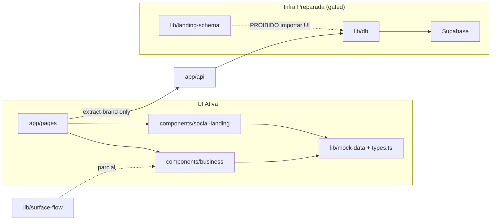

# ARCHITECTURE REPORT — Social Landing

**Data da auditoria:** 23/05/2026  
**Escopo:** Mapeamento estrutural completo (Fase 1) + classificação (Fase 2)  
**Objetivo:** Mapear, proteger e preparar — **sem refatorar**

---

## Sumário executivo

A Social Landing é um produto **Next.js 16 + React 19** com duas arquiteturas de feed paralelas e uma camada de persistência **preparada mas desligada**. O valor perceptivo do produto vive no stack **business** (`BusinessSocialLanding` + `ConversationalAI` + morph). A infraestrutura futura (`lib/landing-schema/`, `lib/db/`) está bem isolada, mas **não conectada à UI**.

**Veredicto:** Arquitetura híbrida — **experiência madura, fundação de dados imatura, acoplamento DOM-perceptivo alto no runtime crítico**.

---

## 1. Estrutura atual do projeto

```
SOCIAL-LANDING/
├── app/                    # App Router — 6 páginas + 4 API routes
├── components/
│   ├── social-landing/     # Stack legado (home /)
│   ├── business/           # Stack principal (demo + verticais)
│   ├── criar/              # Builder isolado (framer-motion)
│   └── ui/                 # shadcn/ui (~55 primitivos)
├── hooks/                  # use-toast, use-mobile (+ duplicatas em ui/)
├── lib/
│   ├── types.ts            # Tipos legados da UI
│   ├── business-types.ts   # 12 verticais (~760 linhas)
│   ├── mock-data/          # Datasets por vertical
│   ├── surface-flow/       # Contratos de produto/conversa (parcial)
│   ├── landing-schema/     # Zod + entidades + publish sandbox (ISOLADO)
│   └── db/                 # Drizzle + Supabase (GATED, server-only)
├── docs/
│   ├── architecture/       # Specs de persistência, RLS, storage
│   └── ai-handoffs/        # Memória operacional (FROZEN, protocolos)
├── drizzle/migrations/     # 4 migrations SQL
└── scripts/                # Smoke tests DB/auth/media
```

**Tech stack:** Tailwind 4, shadcn/ui, Radix, framer-motion (só `/criar`), Drizzle ORM, Supabase (auth/storage/postgres), Zod, Vercel Analytics.

**Feature flags ativos:** `ENABLE_DB`, `ENABLE_AUTH`, `ENABLE_MEDIA_API` (todos `false` por default).

**Ausências relevantes:** `middleware.ts`, `stores/`, server actions, event bus, repositórios implementados, auth UI.

---

## 2. Principais engines/sistemas existentes

| Sistema | Localização | Status |
|---------|-------------|--------|
| **Feed orchestrator (business)** | `business-social-landing.tsx` | Runtime ativo, crítico |
| **Feed orchestrator (legacy)** | `social-landing/index.tsx` | Runtime ativo, paralelo |
| **Composer / Conversational surface** | `conversational-ai.tsx` | Runtime ativo, crítico |
| **Morph layer** | `post-to-chat-morph-layer.tsx` | Runtime ativo, congelado |
| **Context selection** | `conversation-selection-context.tsx` | Runtime ativo |
| **Drawer stack** | `action-drawer`, `business-feed-drawer`, `feed-drawer` | 3 implementações |
| **Publish sandbox** | `lib/landing-schema/publish-sandbox/` | In-memory, testes |
| **Block registry** | `lib/landing-schema/block-registry.ts` | Declarativo, não runtime |
| **Permissions matrix** | `lib/landing-schema/permissions.ts` | Declarativo |
| **Brand extraction** | `app/api/extract-brand/route.ts` | HTTP crawl, sem LLM |
| **Media API** | `app/api/media/*` | Gated 501 |
| **Mock AI resolver** | `lib/mock-data/conversational-search.ts` | Keyword search |

**Não existem** runtime classes `GoalEngine`, `ExperienceEngine`, `RuleEngine`, `EvolutionEngine`. A filosofia documentada rejeita engines monolíticos — capabilities são declarativas em `block-registry.ts`.

---

## 3. Fluxo de renderização

### Superfície `/` (legacy)

```
app/page.tsx
  └── SocialLanding
        ├── Header (fixo)
        ├── Stories
        ├── SectionFeed → PostCard / FeedGrid
        └── FeedDrawer (z-50)
```

Sem composer, sem morph, sem IA.

### Superfície `/demo` (business — coração do produto)

```
app/demo/page.tsx → BusinessSelector
  └── *Feed vertical
        └── ConversationSelectionProvider
              ├── BusinessSocialLanding
              │     ├── BusinessStories → StoryViewer (z-100)
              │     ├── BusinessSection[] (data-section)
              │     ├── ContextSelectable (long-press 420ms)
              │     ├── PostToChatMorphLayer (z-65)
              │     ├── ConversationalAI (z-30/60/70)
              │     └── BusinessFeedDrawer (z-50)
              └── ActionDrawer / vertical drawers (z-50)
```

### Superfície `/criar` (isolada)

Builder com framer-motion. **Não compartilha** componentes de feed/composer business.

### Superfície `/[slug]`

Profile card estático. Fora do fluxo feed/composer.

---

## 4. Fluxo de estados

```
┌─────────────────────────────────────────────────────────────┐
│ ConversationSelectionProvider (por vertical)                │
│   conversationContext[] (max 6)                             │
│   composerMode: default | overlay | hidden                  │
│   composerOffsetClassName (ex: bottom-[88px])               │
└──────────────────────────┬──────────────────────────────────┘
                           │
     ┌─────────────────────┼─────────────────────┐
     ▼                     ▼                     ▼
BusinessSocialLanding  *Feed vertical      ConversationalAI
 drawerOpen            cart/checkout       sheetHeight snaps
 feedDrawerOpen        product selection   messages[]
 morphRequest          checkout steps      localStorage history
 storyViewerOpen
```

**Orquestração z-index:** `BusinessSocialLanding` deriva classes do composer a partir de `feedDrawerOpen`, `drawerOpen`, `composerMode`.

**Sem store global:** cada vertical duplica `useEffect` para `setComposerMode` quando drawers abrem.

---

## 5. Fluxo de eventos

Hoje **não há Event Engine**. Comunicação via:

1. **React props/callbacks** — `onToggleConversationContext`, `onOpenDrawer`
2. **React Context** — `ConversationSelectionContext`
3. **DOM events** — scroll, resize, visualViewport, keydown, pointer events
4. **Module singleton** — `rememberedMorphSource` (TTL 1800ms)
5. **DOM protocol** — atributos `data-*` consultados via `querySelector`
6. **Toast pub/sub** — reducer + listeners (`use-toast.ts`)
7. **localStorage** — histórico de chat por brand

Ver `EVENT_MAP.md` para inventário completo.

---

## 6. Dependências entre módulos



**Regra arquitetural explícita:** `landing-schema` e `db` **não devem** ser importados por components/pages até migração controlada.

**Acoplamento perigoso:** UI business ↔ DOM (`data-*`, `querySelector`) ↔ measurement refs ↔ z-index literals.

---

## 7. Componentes mais críticos

| Tier | Arquivo | Linhas aprox. | Por quê |
|------|---------|---------------|---------|
| **1** | `conversational-ai.tsx` | ~1000 | Sheet, drag, measurement, chips, IA mock, z-index dinâmico |
| **1** | `business-social-landing.tsx` | ~1200 | Orquestrador central feed/stories/drawer/morph/composer |
| **1** | `conversation-selection-context.tsx` | ~90 | Estado compartilhado cross-card |
| **1** | `context-selectable.tsx` | — | Long-press + morph source singleton |
| **1** | `post-to-chat-morph-layer.tsx` | — | RAF animation única não-CSS |
| **2** | `action-drawer.tsx` | — | Scroll lock + composer inset |
| **2** | `business-feed-drawer.tsx` | — | Duplicata parcial de feed-drawer |
| **2** | `app/globals.css` | — | Tokens, safe-area, keyframes |

---

## 8. Sistemas mais frágeis

1. **Morph pipeline** — coordenadas DOM + timing + scroll cancel
2. **Composer measurement** — ResizeObserver + visualViewport + useLayoutEffect
3. **Scroll lock** — mutação direta `document.body.style.overflow` em 3+ drawers
4. **Composer mode orchestration** — duplicada em 9+ verticais sem single source of truth
5. **Story → section navigation** — 4 fallbacks DOM (text match, data-section, id, h2 scan)
6. **Dual feed architecture** — divergência legacy vs business
7. **Build safety** — `typescript.ignoreBuildErrors: true` mascara erros
8. **Bridge UI ↔ schema** — dois sistemas de tipos paralelos (`types.ts` vs `landing-schema`)

---

## 9. Gargalos de performance

| Área | Risco | Severidade |
|------|-------|------------|
| `business-social-landing.tsx` re-renders | Orquestrador grande, muitos filhos | Médio |
| `ConversationalAI` measurement loop | ResizeObserver + layout effects | Médio-alto |
| Morph RAF | 60fps por 480ms — aceitável | Baixo |
| Imagens Unsplash externas | Sem CDN próprio, `unoptimized: true` | Alto em produção |
| 12 verticais carregados em `/demo` | Bundle se não lazy-loaded | Médio |
| localStorage sync chat | Parse/stringify a cada mensagem | Baixo |
| `cloneElement` prop injection | Re-render cascata em sections | Médio |

---

## 10. Pontos de acoplamento perigoso

- **DOM queries globais** no morph (`document.querySelector('[data-conversation-composer]')`)
- **Números mágicos** compartilhados por convenção (`104px`, `88px`, `pb-36`, `pb-48`)
- **Z-index literals** espalhados sem registry runtime
- **Vertical feeds ↔ composerMode** — N cópias do mesmo useEffect
- **FeedDrawer ≈ BusinessFeedDrawer** — drift garantido
- **UI types ↔ landing-schema** — divergência futura na migração
- **Criar flows ↔ runtime feeds** — zero reuso de composer

---

## 11. Hacks temporários identificados

| Hack | Local | Impacto |
|------|-------|---------|
| `rememberedMorphSource` module singleton | `context-selectable.tsx` | Intencional — evita re-render |
| `setTimeout(100)` scroll-to-post | feed drawers | Fragilidade de timing |
| Story navigation fallback chain | `business-social-landing.tsx` | Esconde falta de routing real |
| `getComposerFallbackRect` hardcoded | `business-social-landing.tsx` | Fallback quando chip DOM ausente |
| `reserveComposerSpace` prop morta | `action-drawer.tsx` | API mentirosa |
| `typescript.ignoreBuildErrors` | `next.config.mjs` | Dívida de segurança de tipos |
| `realestate` type cast `as unknown as` | `realestate-feed.tsx` | Tipos inconsistentes |
| Strict Mode morph guard skip cleanup | `post-to-chat-morph-layer.tsx` | Comportamento dev/prod diferente |
| `false && "border-t..."` dead code | `conversational-ai.tsx` | Ruído |

---

## 12. Efeitos colaterais ocultos

- Abrir drawer A **não sabe** se drawer B já lockou body overflow → lock preso
- `composerMode hidden` **não limpa** conversationContext
- Long-press dispara **vibrate(12)** — side effect mobile não documentado em todos os flows
- Chip fica `opacity-0` durante morph — leitores de tela podem perder estado
- `toggleConversationContextItemWithMorph` remove item se já selecionado **antes** de morph
- ThemeProvider existe mas **não está** no layout root
- `useIsMobile` duplicado e subutilizado — feeds usam CSS, não JS

---

## 13. Áreas com risco alto de regressão

1. Qualquer alteração em **timings** (420ms, 480ms, 1800ms, 100ms, 500ms)
2. Alteração de **data-*** attributes ou z-index hierarchy
3. Refactor de **conversational-ai.tsx** sem replay manual mobile/desktop
4. Unificação de **drawers** sem matriz de testes por vertical
5. Mudança em **pb-*** paddings do feed/drawer
6. Troca de **COMPOSER_SURFACE_COLOR**
7. Integração prematura **UI → landing-schema** sem adapter
8. Habilitar **ENABLE_*** flags sem smoke tests completos

---

## Fase 2 — Classificação dos sistemas

### STABLE SYSTEMS (proteger)

- Morph layer + context selectable + long-press threshold
- Composer sheet (drag, snap heights, measurement)
- Z-index hierarchy documentada
- Protocolo `data-*` entre feed e composer
- Scroll lock pattern (com ressalvas)
- `COMPOSER_SURFACE_COLOR` e tokens visuais congelados
- Timings calibrados (ver `SYSTEM_ARCHITECTURE.md`)
- Home legacy `SocialLanding` (baseline premium estático)

### EVOLVING SYSTEMS (evolução gradual)

- `lib/landing-schema/` — entidades, Zod, publish sandbox
- `lib/db/` — Drizzle, auth adapter, media API
- `lib/surface-flow/` — contratos produto/conversa
- Vertical feeds (`*Feed.tsx`) — lógica transacional
- `/criar` flows — onboarding e editor
- `block-registry.ts` — capabilities por business model
- Mock AI → real AI (com safety layer)

### EXPERIMENTAL SYSTEMS (inovação controlada)

- `app/api/extract-brand` — crawl heurístico
- Publish sandbox in-memory
- `conversational-search.ts` keyword resolver
- Verticais lite (influencer, personal, institutional) — Vaul drawer, sem composer stack
- Feature flags de publish (`LANDING_PUBLISH_STRICT_DEFAULT` — documentados, unwired)

### LEGACY / HACK SYSTEMS (isolar futuramente)

- Duplicação `FeedDrawer` / `BusinessFeedDrawer`
- Dual stack `SocialLanding` vs `BusinessSocialLanding`
- `lib/types.ts` paralelo a `landing-schema`
- `styles/globals.css` duplicado de `app/globals.css`
- Toast dual system (`use-toast` + Sonner)
- `typescript.ignoreBuildErrors`
- DOM querySelector orchestration no morph
- Composer mode duplication per vertical

---

## Referências cruzadas

| Documento | Conteúdo |
|-----------|----------|
| `FROZEN_SYSTEMS.md` | Proteção detalhada por sistema |
| `EVENT_MAP.md` | Inventário de eventos |
| `STATE_GOVERNANCE.md` | Governança de estado |
| `docs/ai-handoffs/SYSTEM_ARCHITECTURE.md` | Memória operacional existente |
| `docs/ai-handoffs/composer-continuity-contract.md` | Contrato técnico composer |

---

## Conclusão

A Social Landing tem **DNA de produto claro** (feed contínuo + composer emergente + morph) protegido por documentação operacional sólida em `docs/ai-handoffs/`. A fraqueza estrutural está na **falta de camada de integração** entre UI mock e schema/db, na **duplicação arquitetural** (dois feeds, três drawers), e na **ausência de Event Engine / State governance formal**.

A prioridade não é refatorar — é **congelar o que funciona**, **documentar contratos**, e **preparar adapters** antes de escalar IA, integrações e persistência.
