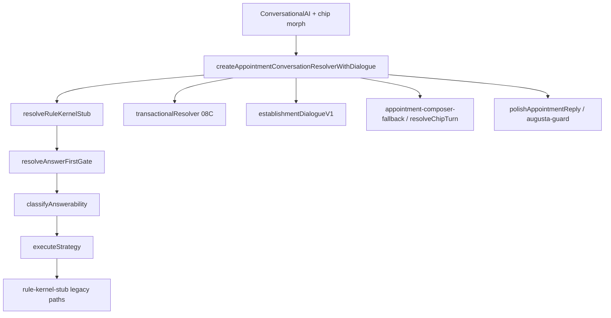

# Auditoria de Continuidade — SOCIAL-LANDING (Appointment / IA conversacional)

**Data:** 2026-06-04  
**Branch local:** `main` (ahead 1 de `origin/main`)  
**Último commit:** `a7ef95f` — WS-19B v1.1 corpus 61 cenários  
**Objetivo ativo:** PATCH P0/P1 — `/demo` Appointment sem tom de script (kernel determinístico, sem LLM amplo)  
**Conversa origem:** patch prioridade máxima + anti-robô (transcript `c703e8f2-a568-43df-8d2e-6ae652d87649`)

---

## Prompt para colar na nova sessão

```txt
Projeto: SOCIAL-LANDING · piloto Barba Negra · /demo Appointment
Baseline doc: docs/audit/CONTINUATION_AUDIT_2026-06-04.md
Handoff operacional: docs/audit/OPERATIONAL_HANDOFF_BASELINE.md (parcialmente desatualizado em hashes)

Trabalho em andamento (NÃO commitado — ver git status):
- Patch conversacional P0/P1: kernel + adapter Appointment + Playwright AP-CHAT
- Muitos arquivos untracked (augusta-guard, resolve-chip-turn, emergency-demo-smoke, WS-20*, etc.)

Gates verdes agora (rodar de novo antes de PR):
  pnpm ts:budget
  pnpm qa:kernel-stub          → 47/47 matrix + WS-19B gate PASS
  npx tsx scripts/convergence/emergency-demo-smoke.ts  → 9/9
  pnpm qa:appointment          → precisa pnpm dev :3000 · era 27/28 (AP-CHAT-03)

Pendência imediata:
1. Confirmar AP-CHAT-03 (post + "fale mais") após wait do chip no Playwright
2. Commitar só o escopo P0/P1 (não .env.local, .next/, data/runtime/external/)
3. Corpus full 70: escape 7.1% — meta global <5% ainda aberta fora do gate scope

Regras:
- Appointment: NUNCA buildMockReply quando resolver composto ativo (disableHostMockFallback)
- Uma fonte de chip: resolveChipTurn / replyFromSelectedContext
- Ordem classify: parking → contextual broad (sessão) → chipLane → pending → transactional → hours/branch → shouldIntentBeatChip
- Não abrir LLM produção sem charter WS-20 + gates
```

---

## 1. Estado Git (crítico para não errar)

### Modificado (staged/unstaged — patch ativo)

| Área | Arquivos principais |
|------|---------------------|
| Kernel | `answerability-classifier.ts`, `rule-kernel-stub.ts`, `missing-context.ts`, `active-topic.ts`, `topic-ownership.ts`, `strategy-executor.ts`, `broad-clarification.ts` |
| UI | `conversational-ai.tsx` (`disableHostMockFallback`), `business-social-landing.tsx` |
| Adapter | `appointment-conversation-kernel-adapter.ts`, `appointment-conversational-search.ts` |
| Eval | `ws19a-kernel-eval-runner-core.ts`, `ws19b-conversational-coverage.json`, matrix JSON |
| E2E | `appointment-ai-resolver-validation.mjs` (AP-CHAT + wait chip) |

### Untracked importantes (existem no disco, não no commit `a7ef95f`)

| Arquivo/pasta | Papel |
|---------------|--------|
| `lib/conversation-kernel/augusta-guard.ts` | Bloqueia copy Augusta / mock; `polishAppointmentReply` |
| `lib/conversation-kernel/naturalize-reply.ts` | Remove `—` / tom robótico |
| `lib/conversation-kernel/resolve-chip-turn.ts` | Reexport unificado |
| `lib/mock-data/appointment-composer-fallback.ts` | Fallback sem `buildMockReply` |
| `scripts/convergence/emergency-demo-smoke.ts` | 9 cenários resolver (sem browser) |
| `app/api/appointment/bounded-rewrite/` | LLM piloto WS-20 (opt-in) |
| `lib/conversation-kernel/llm-bounded/*` | Piloto bounded rewrite |
| `docs/audit/WS-19B_REALITY_BACKLOG.md`, `ws19b-reality-harvest.json` | Reality harvest |
| `docs/audit/WS-20*.md`, scripts `ws20*` | Piloto LLM — **NO-GO produção** |

### Nunca commitar

- `.env.local` (chaves)
- `.next/`, `tsconfig.tsbuildinfo`
- `data/runtime/appointment/external/` (overlay local)
- `docs/audit/experiments/`, `session-b-captures/` (capturas)
- `".gitignore 2"` (lixo acidental)

### Ação recomendada antes do PR

```bash
git status
pnpm ts:budget && pnpm qa:kernel-stub && npx tsx scripts/convergence/emergency-demo-smoke.ts
pnpm dev   # outro terminal
pnpm qa:appointment
```

Separar commit **kernel+adapter+eval** de docs WS-20 se não forem escopo do patch.

---

## 2. Arquitetura conversacional (Appointment)



**Ordem do adapter** (`appointment-conversation-kernel-adapter.ts`):

1. Kernel stub (+ optional `applyBoundedLlmRewrite` se `ENABLE_LLM_BOUNDED`)
2. Se null e não editorial → transactional (08C)
3. Se null e sem chip → dialogue → broad clarify → situated fallback
4. Se ainda null → `resolveAppointmentComposerFallback` (chip → `resolveChipTurn`, senão broad)
5. Sempre `touchKernelSessionFromMessage` no fim

**UI:** `appointment-feed.tsx` passa `conversationResponseResolver`; `disableHostMockFallback={Boolean(resolver)}` impede rotação mock no composer.

---

## 3. Gates e métricas (2026-06-04, workspace local)

| Gate | Resultado | Nota |
|------|-----------|------|
| `pnpm ts:budget` | PASS | Corrigido destructuring `disableHostMockFallback` |
| `pnpm qa:kernel-stub` Phase 1 | **47/47** | E-G41, G42, G28, G33, X11, G09, G26 corrigidos nesta sessão |
| WS-19B gate (42 cenários, non-control) | **PASS** | Escape 0%, critical wrong lane 0, wrong lane ~4.8% |
| Corpus full 70 | Escape **7.1%** (5/70) | Meta global &lt;5% ainda não atingida |
| Corpus wrong lane | **11.4%** (8/70), crítico 6 | Fora do gate; NC/controles contam |
| `emergency-demo-smoke.ts` | **9/9** | Inclui 6 casos “reais” do patch |
| `pnpm qa:appointment` | **27/28** | Falha: **AP-CHAT-03** (chip Playwright); fix: `waitFor [data-conversation-context-chip]` |

**Top escape reasons (corpus 70):** `empty_or_null:3`, `augusta_generic:1`, `broad_clarify_unexpected:1` (+ NC esperados)

---

## 4. O que o patch P0/P1 já resolveu

### Comportamento produto

- Sem `buildMockReply` no Appointment quando resolver ativo
- `resolveChipTurn()` / `replyFromSelectedContext` como fonte única de chip
- Curitiba + post social → **clarify** unidade (não cards barbeiros)
- Follow-up horas após estacionamento → **horário** (não endereço Augusta)
- Vídeo + Curitiba → operacional “sem unidade em Curitiba”
- “sobre isso” / “fale mais” não disparam `missing_context` por substring `"e isso"`
- Copy: sem “veja serviços no feed”, “me diz em uma frase”, loops “Não captei o foco”

### Evals formalmente verdes (matrix)

E-G41, E-G42, E-G36, E-G28, E-G33, E-G45/B-37, E-X11, E-G09, E-G26, E-G38, AP-CHAT-01/02/04/05/06 (smoke), etc.

### Classificador — ordem atual (não inverter sem revalidar 47/47)

```txt
blocked → parking → contextual_broad (me fala + session parking/hours)
→ chipLane (missing_context ANTES shouldIntentBeatChip)
→ pendingClarification → transactional → hours → branch (guard social ambiguous)
→ shouldIntentBeatChip (hours follow-up exception) → …
```

---

## 5. Pendências (prioridade)

### P0 — antes de merge

| # | Item | Como validar |
|---|------|----------------|
| 1 | **AP-CHAT-03** E2E post + `fale mais` | `pnpm qa:appointment` com dev; chip visível no composer |
| 2 | **Commit** escopo patch | Não incluir secrets / `.next` |
| 3 | Re-run gates após qualquer mudança em `classifyAnswerability` | 47/47 + WS-19B gate |

### P1 — logo após merge

| # | Item |
|---|------|
| 4 | Corpus 70: reduzir escape global de 7.1% → &lt;5% (identificar 2 escapes inesperados além de NC) |
| 5 | Wrong lane full corpus: 8 → meta crítico 0 global |
| 6 | Remover código duplicado em `rule-kernel-stub.ts` (handlers vídeo/post após `resolveChipTurn`) — opcional, minimizar diff |
| 7 | Atualizar `OPERATIONAL_HANDOFF_BASELINE.md` hashes + WS-19A Fase 1.5 status |

### P2 — não misturar com patch robô

| # | Item |
|---|------|
| 8 | WS-19C reality capture / promotion workflow |
| 9 | WS-20 LLM bounded (`ENABLE_LLM_BOUNDED`, `OPENAI_API_KEY`, route `bounded-rewrite`) |
| 10 | WS-08D V1.1 gray zone / Fase 2 kernel |

---

## 6. Tabela de arquivos — “onde mexer”

| Sintoma | Arquivo |
|---------|---------|
| Lane errada / ordem | `lib/conversation-kernel/answerability-classifier.ts` |
| Sessão pending / unidade | `lib/conversation-kernel/topic-ownership.ts`, `touchKernelSessionFromMessage` em `rule-kernel-stub.ts` |
| Resposta operacional copy | `replyFromOperational` em `answerability-classifier.ts` |
| Chip / post / vídeo copy | `replyFromSelectedContext`, `replySocialPost` mesmo arquivo |
| Gate classify→execute | `lib/conversation-kernel/strategy-executor.ts` |
| Legacy paths pós-gate | `lib/conversation-kernel/rule-kernel-stub.ts` |
| UI mock fallback | `components/business/conversational-ai.tsx` |
| Wiring demo | `components/business/appointment/appointment-feed.tsx` |
| Resolver composto | `lib/mock-data/appointment-conversation-resolver-composed.ts` |
| Adapter + polish | `lib/mock-data/appointment-conversation-kernel-adapter.ts` |
| Augusta / tom | `lib/conversation-kernel/augusta-guard.ts`, `naturalize-reply.ts` |
| Eval matrix | `docs/audit/ws19a-conversation-kernel-eval-matrix.json` |
| Corpus WS-19B | `docs/audit/ws19b-conversational-coverage.json` |
| Runner | `scripts/convergence/ws19a-kernel-eval-runner-core.ts` |
| Playwright | `scripts/convergence/appointment-ai-resolver-validation.mjs` |
| Smoke rápido | `scripts/convergence/emergency-demo-smoke.ts` |

---

## 7. Cenários de referência (6 casos reais)

| # | Chip | Mensagem | Esperado |
|---|------|----------|----------|
| 1 | Vídeo fade | o que é fede? | Técnica fade no título, sem Augusta |
| 2 | Vídeo tendências | carecas | Gap honesto masculino/carecas |
| 3 | Post | fale mais | Post + sabado/confianca/feed |
| 4 | Serviço | tem estacionamento? | Estacionamento + mapa |
| 5 | Post | tem em Curitiba? | Clarify unidade ou sem filial Curitiba |
| 6 | Sem chip | me fala aí | Broad humano, sem Augusta |

**Antes (bugs):** Augusta loop, cards Curitiba, “Entendi desse conteúdo…”, endereço em vez de horário, `buildMockReply`.

---

## 8. Armadilhas (evitar regressão)

1. **`shouldIntentBeatChip` antes de `chipLane`** — quebra Curitiba+post (operacional direto) e clarify.
2. **`shouldIntentBeatChip` no início de `classifyChipAnswerability`** — anula `in_domain_missing_context`.
3. **`isOperationalHoursQuestion` antes de `transactional`** — “quero marcar um horário” vira hours (E-G09).
4. **Token `"e isso"` com `includes`** — casa em “sobre isso” / “fale mais”.
5. **`detectStrongTopic` → `arrival` para feriados** — mitigado por hours antes de active_topic + branch em `active-topic.ts`.
6. **Playwright sem chip anexado** — resposta broad sem título do post (AP-CHAT-03).
7. **Commitar `.env.local`** ou overlay runtime external.

---

## 9. Documentação relacionada

| Doc | Uso |
|-----|-----|
| `CONTINUATION_AUDIT_2026-06-04.md` | **Este arquivo** — estado jun/2026 |
| `OPERATIONAL_HANDOFF_BASELINE.md` | Runtime, WS fechados, arquivos núcleo (hashes antigos) |
| `CONTINUITY_HANDOFF_AUDIT.md` | Visão produto/perceptiva (2026-05-31, baseline antiga) |
| `WS-19A_FAST_TRACK_PLAN.md` | Sequência PRs, fases, gates |
| `WS-19A_PHASE1_CLOSURE.md` | Fechamento Fase 1 |
| `WS-19A_CONVERSATION_KERNEL_EVAL_MATRIX.md` | IDs E-G*, E-M-APT, E-X* |
| `WS-19B_CONVERSATIONAL_COVERAGE.md` | Corpus B-* |
| `WS-19B_REALITY_BACKLOG.md` | RH-001…010 promoted |
| `WS-20_LLM_BOUNDED_PILOT.md` | LLM opt-in — não misturar com patch determinístico |

---

## 10. Ambiente dev

```bash
pnpm install
pnpm dev                    # http://localhost:3000/demo → Agendamento → Barba Negra
pnpm qa:appointment         # Playwright · DEMO_URL default localhost:3000/demo
```

**LLM piloto (opcional, off por default):**

```env
ENABLE_LLM_BOUNDED=false
NEXT_PUBLIC_ENABLE_LLM_BOUNDED=false
# OPENAI_API_KEY=...
# LLM_REWRITE_ELIGIBLE_TOPICS=post_editorial
```

---

## 11. Histórico desta thread (resumo)

1. Auditoria conversacional completa (P0/P1/P2) — entregue no chat, não só em MD.
2. Implementado patch anti-robô: kernel, adapter, UI, evals, smoke.
3. Regressões corrigidas: E-G41/42/28/33/X11/G09/G26, B-37.
4. WS-19B **gate scope PASS**; corpus full ainda 7.1% escape.
5. `pnpm qa:appointment` 27/28 — AP-CHAT-03 pendente confirmação pós-fix Playwright.

**Próximo passo único recomendado:** rodar `pnpm qa:appointment` → se 28/28, commit escopo P0/P1 → PR.
