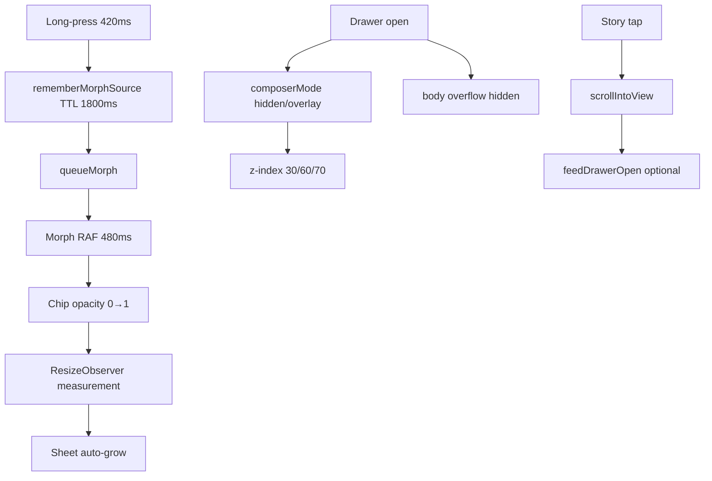

# EVENT MAP — Social Landing

**Data:** 23/05/2026  
**Fase:** 4 — Event Architecture

---

## Situação atual

**Não existe Event Engine centralizado.** O sistema usa comunicação implícita via React callbacks, Context, DOM events, module singletons e localStorage. Isso funcionou na fase mock, mas **não escala** para Goal Engine, integrações webhook, IA contextual ou automações.

---

## Inventário de eventos

### A. Eventos de interação do usuário

| Evento | Disparador | Consumidor(es) | Efeito colateral |
|--------|-----------|----------------|------------------|
| **Post click (content)** | `PostCard`, feed cards | `BusinessSocialLanding` → `setFeedDrawerOpen(true)` | Abre feed drawer, pode elevar composer z-60 |
| **Post click (action/product)** | Vertical cards | `*Feed` → `setDrawerOpen(true)` | ActionDrawer, composerMode hidden/overlay |
| **Long-press (420ms)** | `ContextSelectable` | `toggleConversationContextItemWithMorph` | Vibrate(12), morph queue, chip upsert |
| **Context chip remove** | Chip X button | `removeConversationContext` | Chip DOM change → measurement shift |
| **Composer send** | Form submit | `conversational-ai.tsx` | Mock AI reply 700ms, localStorage write, scroll messages |
| **Composer drag** | Pointer events | Sheet height snap | Disables CSS transition during drag |
| **Story tap** | `StoryViewer` | Section scroll / drawer open | 500ms delay, scrollIntoView fallbacks |
| **Story section nav** | Story CTA | DOM query `data-section` | Pode abrir primeiro post se fallback |
| **Drawer close** | Backdrop/button | Drawer `onClose` | Restaura body overflow, composerMode reset (vertical) |
| **Cart add** | Vertical CTAs | Local cart state | Restaurant cart bar visible, composer offset |
| **Demo model switch** | `BusinessSelector` | Re-mount vertical feed | **Perde** conversation state se não resetado |
| **Category/story horizontal scroll** | Touch/wheel | Local scroll containers | Nenhum global listener |

### B. Eventos de layout / browser

| Evento | Disparador | Consumidor | Efeito colateral |
|--------|-----------|------------|------------------|
| **window resize** | Browser | `ConversationalAI.measureSheetLayout`, morph cancel | Sheet height recalc |
| **visualViewport resize/scroll** | Mobile keyboard | Composer measurement | Layout shift, morph cancel |
| **window scroll (capture)** | User scroll | `PostToChatMorphLayer` | Cancel morph RAF |
| **ResizeObserver** | DOM size change | Composer refs | Auto-grow, chip measurement |
| **keydown Cmd/Ctrl+B** | Keyboard | `sidebar.tsx` | Toggle admin sidebar (não usado em feeds) |
| **matchMedia change** | Viewport | `use-mobile` | Breakpoint flag |

### C. Eventos de estado React (pseudo-eventos)

| Pseudo-evento | Origem | Destino | Risco |
|---------------|--------|---------|-------|
| `composerMode` change | Vertical useEffect | `ConversationalAI` className | Race se múltiplos drawers |
| `conversationContext` upsert | Toggle/long-press | Chips + AI context | Max 6 silent truncate |
| `drawerOpen` + `feedDrawerOpen` | BusinessSocialLanding | Composer visibility z-index | Lógica `(drawerOpen && !feedDrawerOpen) \|\| hidden` |
| `morphRequest` state | queueMorph | PostToChatMorphLayer | Strict Mode edge case |
| Toast `dispatch` | Any toast call | `memoryState` listeners | Global, limit 1 toast |

### D. Eventos de persistência

| Evento | Disparador | Storage | Key pattern |
|--------|-----------|---------|-------------|
| Chat history save | Message add/remove | localStorage | `business-conversation-history:{brand}` |
| Sidebar state | Sidebar toggle | cookie | `sidebar_state` (7d) |

### E. Eventos server (API)

| Evento | Route | Trigger | Response side effects |
|--------|-------|---------|----------------------|
| Brand extract | POST `/api/extract-brand` | `/criar` form | HTTP fetch external URL |
| Media upload request | POST `/api/media/upload/request` | Future editor | 501 if gated |
| Media confirm | POST `/api/media/upload/confirm` | Client PUT complete | DB write if enabled |
| Signed URL | GET `/api/media/[id]/signed-url` | Media render | Auth + permission check |

**Webhooks:** nenhum implementado.

---

## Dependências indiretas (invisíveis)



---

## Eventos perigosos

| Evento | Por quê é perigoso |
|--------|-------------------|
| **composerMode set from multiple useEffects** | Last-write-wins race entre cart drawer e product drawer |
| **body overflow lock** | Não refcounted — segundo drawer close pode unlock prematuramente |
| **Morph during layout shift** | Keyboard open mid-morph → wrong coordinates |
| **localStorage chat write** | Blocking main thread; no schema version |
| **Story fallback open first post** | Mascara missing section mapping |
| **Demo vertical switch** | Stale conversationContext de brand anterior |
| **extract-brand fetch** | SSRF risk se URL não validada (auditar route) |

---

## Loops possíveis

1. **Measurement loop:** ResizeObserver → setState → layout → ResizeObserver (mitigado parcialmente por refs)
2. **Composer mode oscillation:** Drawer A opens (hidden) → Drawer B opens (overlay) → close order wrong → flicker
3. **Morph re-trigger:** Toggle off item that triggers remove + re-add via Strict Mode double mount
4. **Auto-scroll loop:** New message → scrollIntoView → viewport change → measureSheetLayout → height change → scroll again

**Nenhum loop infinito confirmado em produção**, mas measurement + auto-scroll é zona de risco.

---

## Excesso de listeners

| Local | Listeners | Problema |
|-------|-----------|----------|
| `conversational-ai.tsx` | resize + visualViewport + ResizeObserver | OK se cleanup correto |
| `post-to-chat-morph-layer.tsx` | scroll + resize capture | Duplicado por morph instance |
| 9+ vertical useEffects | composerMode | Lógica duplicada, não listeners DOM |

---

## Estados derivados frágeis

| Derivado | Fonte | Fragilidade |
|----------|-------|-------------|
| Composer z-index class | feedDrawerOpen + composerMode | Não centralizado |
| `selectedContextIds` | conversationContext | OK (useMemo) |
| Sheet height | refs + drag state | Depende de DOM |
| Cart total display | cart[] local per vertical | Não compartilhado |
| `isConversationSelected` | context + card id | ID collision across verticals se mock reuse |

---

## Recomendação: EVENT ENGINE centralizado

### Princípios

1. **Não substituir React** para UI local — Event Engine para **cross-cutting domain events**
2. **Fail-safe:** handlers idempotentes, sem side effects em render
3. **Typed contracts** — discriminated union por event name
4. **Não tocar Tier 1** até adapter layer pronto

### Arquitetura proposta (futura)

```
lib/event-engine/
├── contracts.ts      # EventEnvelope<T>, EventName union
├── bus.ts            # subscribe, emit, once (in-process)
├── middleware/       # logging, validation, rate limit
├── adapters/
│   ├── dom-bridge.ts     # Optional: data-* → events (migration path)
│   └── webhook-bridge.ts # n8n, CRM (server)
└── index.ts
```

### Contratos de eventos (esboço)

```typescript
type DomainEvent =
  | { type: "surface.opened"; surface: "feed-drawer" | "action-drawer" | "composer"; meta: { vertical: string } }
  | { type: "context.item.toggled"; item: ConversationContextItem; source: "long-press" | "tap" }
  | { type: "context.morph.requested"; itemId: string; sourceRect: DOMRectReadOnly }
  | { type: "context.morph.completed"; itemId: string }
  | { type: "context.morph.cancelled"; reason: "scroll" | "resize" | "unmount" }
  | { type: "composer.mode.changed"; from: ComposerMode; to: ComposerMode; reason: string }
  | { type: "conversation.message.sent"; brandId: string; messageId: string }
  | { type: "integration.webhook.received"; provider: string; payload: unknown }
  | { type: "goal.completed"; goalId: string; brandId: string }
```

### Padronização

| Regra | Descrição |
|-------|-----------|
| **Naming** | `{domain}.{entity}.{action}` lowercase dot notation |
| **Payload** | Sempre serializável (sem DOM refs — usar rects snapshot) |
| **Version** | `schemaVersion: 1` em cada envelope |
| **Causality** | `correlationId` para cadeias morph → chip → AI reply |
| **Forbidden in handlers** | Direct `document.body.style` — emit `surface.scroll-lock.request` |
| **Migration** | Phase 1: log-only tap no bus; Phase 2: composerMode via reducer; Phase 3: webhook ingress |

### Prioridade de implementação

1. **composer.mode.changed** — elimina race entre verticais
2. **surface.opened/closed** — scroll lock refcount
3. **context.*** — morph pipeline observability
4. **integration.*** — quando ENABLE_DB=true

---

## Mapa disparador → consumidor (visual)

```
USER
 ├─ tap post ──────────────► BusinessSocialLanding ──► BusinessFeedDrawer
 ├─ long-press ────────────► ContextSelectable ──► MorphLayer ──► Composer chips
 ├─ send message ──────────► ConversationalAI ──► mock resolver ──► localStorage
 ├─ open cart ─────────────► *Feed ──► setComposerMode("hidden")
 └─ switch demo vertical ──► BusinessSelector ──► [GAP: no reset event]

BROWSER
 ├─ scroll ────────────────► MorphLayer.cancel
 ├─ resize/viewport ───────► ConversationalAI.measure
 └─ reduced-motion ────────► MorphLayer.skip

SERVER (future)
 ├─ webhook ───────────────► [NOT IMPLEMENTED]
 └─ publish ───────────────► publish-sandbox (in-memory only)
```

---

## Conclusão

O sistema atual é **event-implicit** — funcional para demo, **perigoso para escala**. A introdução de Event Engine deve ser **incremental e observability-first**, começando por `composerMode` e scroll lock, **sem reescrever** morph/composer Tier 1.

---

## Atualização — Event bus passivo implementado (23/05/2026)

**Implementação:** `lib/events/` + `docs/audit/EVENT_CONTRACTS.md`

| Status | Detalhe |
|--------|---------|
| ✅ Bus passivo | `emitPassiveEvent` — sync, no side effects |
| ✅ DEV replay | Ring buffer 200 eventos |
| ✅ DEV panel | `EventDebugPanel` em `/demo` |
| ✅ Wired | composer.mode, drawer/surface, vertical.changed, whatsapp.clicked |
| ⏳ Pending Tier 1 protocol | morph.*, ai.surface.opened, feed.item.viewed |

**Regra:** Event bus **nunca** substitui React state ou composerMode runtime.

---

## Atualização — Wiring Tier 1 observacional (23/05/2026)

| Evento | Ponto exato | Arquivo | Linhas |
|--------|-------------|---------|--------|
| `morph.started` | `useLayoutEffect` quando `queuedMorph` → `activeMorph` | `business-social-landing.tsx` | Antes de `setActiveMorph` |
| `morph.completed` | Callback `onComplete` existente do `PostToChatMorphLayer` | `business-social-landing.tsx` | Primeira linha do callback |
| `ai.surface.opened` | Após `setIsConversationSessionActive(true)` em `handleSendMessage` | `conversational-ai.tsx` | Uma linha |

**Não alterado:** `post-to-chat-morph-layer.tsx` (RAF, timings, scroll cancel), z-index, drag, measurement.

**Semântica observacional:**
- `morph.completed` dispara em conclusão natural **e** em cancelamento scroll/resize (via `onComplete` existente)
- `ai.surface.opened` dispara na **primeira mensagem enviada** (sessão conversacional ativa), não no mount do composer
