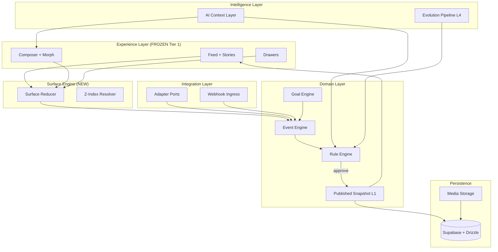

# FUTURE ARCHITECTURE — Social Landing

**Data:** 23/05/2026  
**Fase:** 7 — Future Architecture Readiness

---

## Visão alvo

Plataforma viva de marcas com:
- Goal Engine, Experience Engine, AI Context Layer
- Evolution Engine, Rule Engine, Brand DNA
- Integrações modulares, comportamento adaptativo
- Evolução gradual baseada em aprendizado
- Preservação do DNA da marca

---

## Avaliação por capacidade futura

| Capacidade | Suporte atual | Gap | Reorganização necessária |
|------------|---------------|-----|--------------------------|
| **Goal Engine** | ❌ Nenhum runtime | Modelo Goal, tracking, UI | Nova camada `lib/goals/` + event bus |
| **Experience Engine** | ⚠️ Parcial | surface-flow contracts, composer modes manuais | Centralizar surface reducer + experiments |
| **AI Context Layer** | ⚠️ Parcial | conversationContext max 6, mock resolver | Context port + RAG from published snapshot |
| **Evolution Engine** | ⚠️ Parcial | publish-sandbox in-memory | Pipeline L4→L1 + approval |
| **Rule Engine** | ⚠️ Parcial | permissions.ts, block-registry capabilities | Runtime evaluator (EVOLUTION_RULES.md) |
| **Brand DNA** | ⚠️ Parcial | Brand entity schema, extract-brand | DNA immutable view + tone guidelines |
| **Integração modular** | ⚠️ Parcial | lib/db adapters pattern | `lib/integrations/` ports |
| **Comportamento adaptativo** | ❌ | composerMode manual per vertical | Experience Engine + flags |
| **IA contextual** | ⚠️ Mock | conversational-ai inline | AI.port + streaming |
| **Automações** | ❌ | crawl_jobs schema only | Webhook + n8n bridge |
| **Evolução por regras** | ⚠️ Declarativa | block-registry, permissions | Wire to runtime |

---

## O que já suporta (fundações sólidas)

### 1. Separação UI / Schema / DB

```
UI (mock)  ←── PROIBIDO import direto ──→  landing-schema
                                              ↓
                                           lib/db (gated)
```

Esta tríade é **correta arquiteturalmente**. Protege Tier 1 UI durante migração.

### 2. Block registry + capabilities

`lib/landing-schema/block-registry.ts` mapeia `BusinessModel → capabilities`:

- `composer.enabled`, `morph.enabled`, `ai_generation.allowed`
- `cart.enabled`, `booking.enabled`, etc.

**Serve como proto-Rule-Engine declarativo** para editor, publish e geração — não ainda para runtime feeds.

### 3. Permissions matrix

`lib/landing-schema/permissions.ts` — role → capability (`landing.publish`, `media.upload`, `crawl.start`).

Alinhado com RLS migrations. **Authz pronta**, auth UI não.

### 4. Publication versioning

`publication-versions` + publish sandbox + snapshot assembler.

**Rollback arquitetural possível** — falta wiring produção.

### 5. Surface flow contracts

`lib/surface-flow/contracts.ts`:

```typescript
SurfaceMode = "feed" | "conversation" | "drawer"
SurfaceIntent = "discover" | "deepen" | "execute"
ProductFlow { entrySurface, intent, detailTarget, executeTarget }
```

**Semente do Experience Engine** — subutilizada; UI não importa formalmente.

### 6. Memória operacional

`docs/ai-handoffs/` — FROZEN_SYSTEMS, protocols, evolution log.

**Diferencial raro** — preserva contratos invisíveis para agentes humanos e IA.

---

## O que precisa ser reorganizado

### Prioridade 1 — Bridge layer

```
lib/adapters/
├── ui-to-schema/     # Brand mock → LandingSnapshot view
├── schema-to-ui/     # Snapshot → feed props
└── publish-to-runtime/ # Live landing loader
```

**Sem isso:** Goal/AI/Evolution operam em dados diferentes da UI.

### Prioridade 2 — Surface state central

Substituir 9× `useEffect setComposerMode` por:

```
lib/surface-engine/
├── surface-reducer.ts
├── composer-mode-policy.ts
└── z-index-resolver.ts
```

Alimentado por domain events (EVENT_MAP.md).

### Prioridade 3 — Unificar feed runtime (longo prazo)

Legacy `SocialLanding` vs `BusinessSocialLanding` → shared primitives:

- `FeedColumn`, `FeedDrawerBase`, `StoriesBase`
- Vertical-specific **content only**

**Não urgente** — risco alto. Fazer após schema bridge.

### Prioridade 4 — Event + Rule runtime

```
Event Engine → Rule Engine → [allow|block|queue]
                    ↑
              Brand DNA (read-only)
```

---

## O que pode virar gargalo futuro

| Gargalo | Por quê | Quando dói |
|---------|---------|------------|
| `business-social-landing.tsx` monolith | Orquestra tudo | Cada nova superfície |
| `conversational-ai.tsx` monolith | IA + UI + storage | LLM streaming + tools |
| Duplicata drawer implementations | 3× scroll lock | Bug fix triplicado |
| Sem middleware auth | Session stale | ENABLE_AUTH=true |
| `ignoreBuildErrors` | Types mentem | Escala time/devs |
| Mock data por vertical | 12 arquivos | Personalização real |
| External Unsplash URLs | Latência, ToS | Produção |
| localStorage chat | Sem sync multi-device | Auth users |
| No repository layer | DB logic scattered | ENABLE_DB=true |
| Vertical copy-paste composerMode | N verticais | Cada novo drawer type |

---

## Arquitetura alvo (diagrama)



---

## Goal Engine — desenho mínimo

```typescript
interface BrandGoal {
  id: string
  brandId: string
  type: "conversion" | "engagement" | "education" | "retention"
  metric: string
  target: number
  window: "session" | "7d" | "30d"
  constraints: BrandDNAConstraint[]
}
```

- **Input:** domain events (message sent, product viewed, CTA clicked)
- **Output:** suggestions to Experience Engine (reorder, highlight) — **never direct Tier 1 mutation**
- **Storage:** new table or extend audit-logs

---

## Experience Engine — desenho mínimo

- Consome Goal Engine + Brand DNA + feature flags
- Propõe **experiments** (L4): section order, CTA copy, story order
- Aplica via publish pipeline — **not live patch Tier 1**

---

## AI Context Layer — desenho mínimo

```
Context = PublishedSnapshot
        + conversationContext (session)
        + visitor session (anonymous)
        + BrandDNA tone rules
        → LLM with tool whitelist
```

Tools permitidos (inicial): search products, suggest post, answer FAQ.  
Tools proibidos: mutate layout, change colors, alter z-index.

---

## Migration path (12 meses sugerido)

| Quarter | Milestone |
|---------|-----------|
| Q1 | Event bus log-only + surface reducer + schema bridge read |
| Q2 | ENABLE_DB dev + published `[slug]` from snapshot |
| Q3 | AI.port + Rule Engine MVP + Goal tracking |
| Q4 | First integration (WhatsApp/Instagram read) + Evolution approval UI |

---

## Conclusão

A arquitetura atual **não impede** o futuro desejado — a direção em `landing-schema` e docs é correta. O risco é **pular camadas** (ligar LLM direto no composer) e **destruir Tier 1**. Sequência correta: **bridge → events → rules → intelligence → integrations**.
